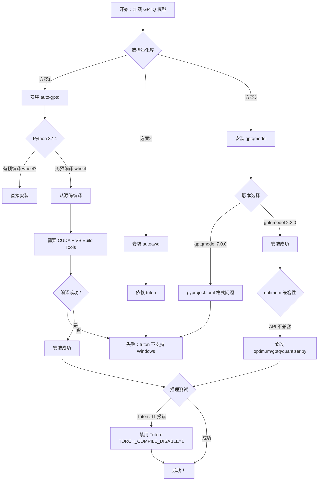
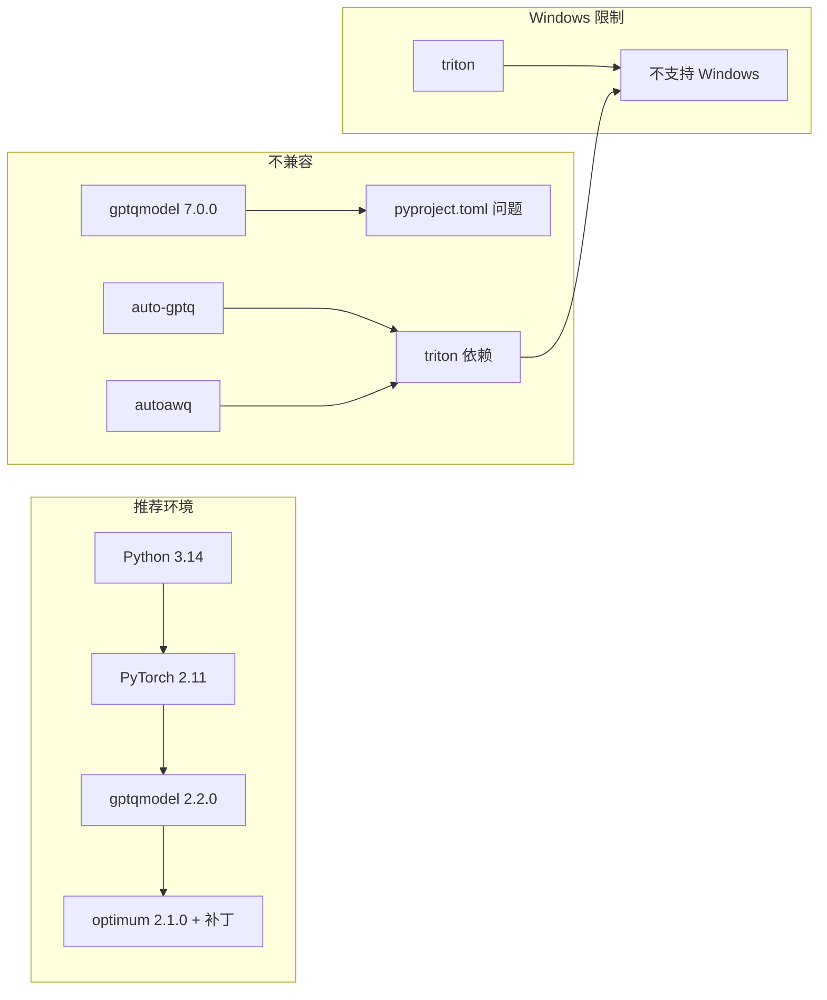

# GPTQ 预量化模型部署指南（Windows + Python 3.14）

> **项目**：D:\qwen3-asr（qwen3-asr-tools repo）  
> **环境**：Windows 10/11 + Python 3.14 + NVIDIA RTX 5060 8GB  
> **目标模型**：Qwen2.5-7B-Instruct-GPTQ-Int4  
> **完成日期**：2026-05-13

---

## 目录

1. [环境准备](#1-环境准备)
2. [问题与尝试](#2-问题与尝试)
3. [最终解决方案](#3-最终解决方案)
4. [测试验证](#4-测试验证)
5. [故障排查](#5-故障排查)
6. [附录](#附录)

---

## 1. 环境准备

### 1.1 系统要求

| 组件 | 版本要求 | 说明 |
|------|----------|------|
| Python | 3.14+ | 本指南使用 Python 3.14 |
| NVIDIA GPU | CUDA Compute Capability 7.0+ | RTX 5060 Blackwell 架构 |
| GPU 显存 | ≥ 8GB | 7B-GPTQ-Int4 需要约 5.5GB |
| CUDA Toolkit | 12.1+ | 用于编译 C++ 扩展 |
| VS Build Tools | 2022+ | Windows 编译工具链 |

### 1.2 安装 CUDA Toolkit

**下载链接**：https://developer.nvidia.com/cuda-downloads

选择以下配置：
- Operating System: Windows
- Architecture: x86_64
- Version: 10/11
- Installer Type: exe (local)

**安装步骤**：

```powershell
# 1. 下载 CUDA 12.1 安装包（约 3GB）
# 链接：https://developer.nvidia.com/cuda-12-1-0-download-archive

# 2. 运行安装程序
# 建议选择 "Custom" 安装，安装路径：D:\NVIDIA\CUDA\v12.1

# 3. 验证安装
D:\NVIDIA\CUDA\v12.1\bin\nvcc.exe --version
# 输出：Cuda compilation tools, release 12.1, V12.1.66
```

**设置环境变量**：

```powershell
# PowerShell（管理员）
[Environment]::SetEnvironmentVariable("CUDA_HOME", "D:\NVIDIA\CUDA\v12.1", "Machine")
[Environment]::SetEnvironmentVariable("CUDA_PATH", "D:\NVIDIA\CUDA\v12.1", "Machine")

# 添加到 PATH
$env:Path = "D:\NVIDIA\CUDA\v12.1\bin;" + $env:Path
```

**验证 CUDA 安装**：

```powershell
# 检查 nvcc
nvcc --version

# 检查 NVIDIA 驱动
nvidia-smi
# 应显示 GPU 信息和驱动版本
```

### 1.3 安装 Visual Studio Build Tools

**下载链接**：https://visualstudio.microsoft.com/downloads/

选择 "Build Tools for Visual Studio 2022"

**安装步骤**：

```powershell
# 1. 下载 VS_BuildTools.exe

# 2. 运行安装程序，选择以下工作负载：
#    - "使用 C++ 的桌面开发" (Desktop development with C++)

# 3. 确保包含以下组件：
#    - MSVC v143 - VS 2022 C++ x64/x86 生成工具
#    - Windows 10/11 SDK
#    - C++ CMake tools for Windows
```

### 1.4 创建 Python 虚拟环境

```powershell
# 创建虚拟环境
python -m venv D:\qwen3-asr\venv

# 激活虚拟环境
D:\qwen3-asr\venv\Scripts\Activate.ps1

# 安装基础依赖
pip install torch torchvision torchaudio --index-url https://download.pytorch.org/whl/cu121
pip install transformers accelerate safetensors
```

---

## 2. 问题与尝试

### 2.1 整体流程图



### 2.2 尝试方案一：auto-gptq

**尝试安装**：

```powershell
# 尝试直接安装
pip install auto-gptq

# 错误信息：
# ERROR: No matching distribution found for auto-gptq
# 原因：Python 3.14 太新，没有预编译的 wheel
```

**尝试从源码编译**：

```powershell
# 克隆仓库
git clone https://github.com/AutoGPTQ/AutoGPTQ.git
cd AutoGPTQ

# 设置 CUDA 环境
$env:CUDA_HOME = "D:\NVIDIA\CUDA\v12.1"
$env:CUDA_PATH = "D:\NVIDIA\CUDA\v12.1"

# 安装构建依赖
pip install build

# 尝试构建
python -m build --wheel

# 错误信息：
# ImportError: triton not found
# 原因：auto-gptq 依赖 triton，而 triton 不支持 Windows
```

**结论**：❌ auto-gptq 在 Windows + Python 3.14 下无法安装

### 2.3 尝试方案二：autoawq

**尝试安装**：

```powershell
pip install autoawq

# 错误信息：
# ERROR: Could not find a version that satisfies the requirement autoawq
# 原因：autoawq 依赖 triton，而 triton 不支持 Windows
```

**结论**：❌ autoawq 在 Windows 下无法安装（依赖 triton）

### 2.4 尝试方案三：gptqmodel 7.0.0

**尝试安装**：

```powershell
pip install gptqmodel==7.0.0

# 错误信息：
# configuration error: `project.license` must be valid exactly by one definition
# GIVEN VALUE: "Apache-2.0"
# 
# 原因：setuptools >= 77.0.1 要求 license 字段必须是以下格式之一：
#   - license = {text = "Apache-2.0"}
#   - license = {file = "LICENSE"}
# 而 gptqmodel 7.0.0 使用的是旧格式：license = "Apache-2.0"
```

**尝试手动修复 pyproject.toml**：

```powershell
# 1. 下载源码
pip download gptqmodel==7.0.0 --dest D:\temp_wheels --no-deps

# 2. 解压
cd D:\temp_wheels
tar -xzf gptqmodel-7.0.0.tar.gz
cd gptqmodel-7.0.0

# 3. 修改 pyproject.toml
# 将：
#   license = "Apache-2.0"
# 改为：
#   license = {text = "Apache-2.0"}

# 4. 重新安装
pip install . --no-build-isolation

# 新的错误：
# ERROR: device-smi 也有同样的 pyproject.toml 问题
# 原因：gptqmodel 依赖 device-smi>=0.5.5，而 device-smi 也有 license 字段格式问题
```

**结论**：❌ gptqmodel 7.0.0 依赖链问题太多，放弃

### 2.5 最终选择：gptqmodel 2.2.0

```powershell
pip install gptqmodel==2.2.0

# 安装成功！但遇到新问题：
# optimum 2.1.0 与 gptqmodel 2.2.0 API 不兼容
```

---

## 3. 最终解决方案

### 3.1 安装依赖

```powershell
# 激活虚拟环境
D:\qwen3-asr\venv\Scripts\Activate.ps1

# 安装 gptqmodel 2.2.0
pip install gptqmodel==2.2.0

# 卸载 auto-gptq（避免版本检查报错）
pip uninstall auto-gptq -y

# 确保 optimum 已安装
pip install optimum
```

### 3.2 修改 optimum/gptq/quantizer.py

**文件位置**：`D:\qwen3-asr\venv\Lib\site-packages\optimum\gptq\quantizer.py`

**修改 1：导入部分（约第 45-60 行）**

将：
```python
if is_gptqmodel_available():
    from gptqmodel import BACKEND, QuantizeConfig
    try:
        from gptqmodel import exllama_set_max_input_length
    except ImportError:
        exllama_set_max_input_length = None
    from gptqmodel.quantization import FORMAT, GPTQ
    try:
        from gptqmodel.quantization import METHOD
    except ImportError:
        from gptqmodel.quantization import QUANT_METHOD as METHOD
    try:
        from gptqmodel.utils.importer import hf_select_quant_linear_v2
    except ImportError:
        hf_select_quant_linear_v2 = None
```

改为：
```python
if is_gptqmodel_available():
    from gptqmodel import BACKEND, QuantizeConfig
    try:
        from gptqmodel import exllama_set_max_input_length
    except ImportError:
        exllama_set_max_input_length = None
    from gptqmodel.quantization import FORMAT, GPTQ
    try:
        from gptqmodel.quantization import METHOD
    except ImportError:
        from gptqmodel.quantization import QUANT_METHOD as METHOD
    try:
        from gptqmodel.utils.importer import hf_select_quant_linear_v2
    except ImportError:
        # gptqmodel < 7.0 uses hf_select_quant_linear
        try:
            from gptqmodel.utils.importer import hf_select_quant_linear as hf_select_quant_linear_v2
        except ImportError:
            hf_select_quant_linear_v2 = None
```

**修改 2：select_quant_linear 方法（约第 223 行）**

将：
```python
def select_quant_linear(self, device_map: Union[str, dict], pack: bool = False):
    self.quant_linear = hf_select_quant_linear_v2(
        bits=self.bits,
        group_size=self.group_size,
        desc_act=self.desc_act,
        sym=self.sym,
        format=self.format,
        quant_method=METHOD.GPTQ,
        meta=self.meta,
        device_map=device_map,
        backend=self.backend,
        pack=pack,
    )
```

改为：
```python
def select_quant_linear(self, device_map: Union[str, dict], pack: bool = False):
    # Use checkpoint_format instead of format for gptqmodel < 7.0
    checkpoint_format = self.format if isinstance(self.format, str) else str(self.format)
    self.quant_linear = hf_select_quant_linear_v2(
        bits=self.bits,
        group_size=self.group_size,
        desc_act=self.desc_act,
        sym=self.sym,
        checkpoint_format=checkpoint_format,
        meta=self.meta,
        device_map=device_map,
        backend=self.backend,
        pack=pack,
    )
```

**关键变更**：
| 原 API (gptqmodel 7.0.0) | 新 API (gptqmodel 2.2.0) |
|--------------------------|--------------------------|
| `hf_select_quant_linear_v2` | `hf_select_quant_linear` |
| `METHOD` | `QUANT_METHOD` |
| `format` | `checkpoint_format` |
| `quant_method` 参数 | 不存在，需移除 |

### 3.3 禁用 Triton JIT

**方法 1：代码中设置**

```python
import os
os.environ['TORCH_COMPILE_DISABLE'] = '1'

import torch
torch._dynamo.config.disable = True
```

**方法 2：环境变量（推荐用于 Web 服务）**

```powershell
# PowerShell
$env:TORCH_COMPILE_DISABLE = '1'

# 或在系统环境变量中设置
[Environment]::SetEnvironmentVariable("TORCH_COMPILE_DISABLE", "1", "Machine")
```

### 3.4 下载 GPTQ 模型

**模型链接**：https://huggingface.co/Qwen/Qwen2.5-7B-Instruct-GPTQ-Int4

```powershell
# 方法 1：使用 huggingface-cli
pip install huggingface_hub
huggingface-cli download Qwen/Qwen2.5-7B-Instruct-GPTQ-Int4 --local-dir D:\qwen3-asr\models\Qwen\Qwen2.5-7B-Instruct-GPTQ-Int4

# 方法 2：使用 Python 脚本下载
python -c "
from huggingface_hub import snapshot_download
snapshot_download(
    repo_id='Qwen/Qwen2.5-7B-Instruct-GPTQ-Int4',
    local_dir=r'D:\qwen3-asr\models\Qwen\Qwen2.5-7B-Instruct-GPTQ-Int4'
)
"
```

---

## 4. 测试验证

### 4.1 基础测试脚本

**文件**：`D:\qwen3-asr\test_gptq_trust.py`

```python
"""
Test GPTQ model loading with gptqmodel 2.2.0
"""
import os
os.environ['TORCH_COMPILE_DISABLE'] = '1'  # Disable Triton JIT

import torch
torch._dynamo.config.disable = True

from transformers import AutoModelForCausalLM, AutoTokenizer, AutoConfig

model_path = r"D:\qwen3-asr\models\Qwen\Qwen2.5-7B-Instruct-GPTQ-Int4"

print(f"Test model: {model_path}")
print(f"CUDA available: {torch.cuda.is_available()}")
print(f"GPU: {torch.cuda.get_device_name(0)}")
print()

# Check model config
print("1. Check model config...")
config = AutoConfig.from_pretrained(model_path, trust_remote_code=True)
print(f"   Model type: {config.model_type}")
if hasattr(config, 'quantization_config'):
    print(f"   Quantization config: {config.quantization_config}")
print()

# Load tokenizer
print("2. Loading Tokenizer...")
tokenizer = AutoTokenizer.from_pretrained(model_path, trust_remote_code=True)
print("   [OK] Tokenizer loaded")
print()

# Load model
print("3. Loading Model (GPTQ)...")
model = AutoModelForCausalLM.from_pretrained(
    model_path,
    device_map="auto",
    trust_remote_code=True,
)
print("   [OK] Model loaded")
print()

# Test inference
print("4. Testing inference...")
messages = [
    {"role": "user", "content": "Hello, please introduce yourself briefly."}
]
input_text = tokenizer.apply_chat_template(messages, tokenize=False, add_generation_prompt=True)
inputs = tokenizer(input_text, return_tensors="pt").to(model.device)

print("   Generating...")
with torch.no_grad():
    outputs = model.generate(
        **inputs,
        max_new_tokens=50,
        do_sample=True,
        temperature=0.7
    )

response = tokenizer.decode(outputs[0][inputs['input_ids'].shape[1]:], skip_special_tokens=True)
print(f"   [OK] Inference success")
print(f"   Response: {response}")
print()

# Memory usage
print("5. Memory usage:")
print(f"   Allocated: {torch.cuda.memory_allocated() / 1024**2:.1f} MB")
print(f"   Reserved: {torch.cuda.memory_reserved() / 1024**2:.1f} MB")
print()

print("[SUCCESS] GPTQ model works correctly!")
```

**运行测试**：

```powershell
cd D:\qwen3-asr
D:\qwen3-asr\venv\Scripts\python.exe test_gptq_trust.py
```

### 4.2 预期输出

```
Test model: D:\qwen3-asr\models\Qwen\Qwen2.5-7B-Instruct-GPTQ-Int4
CUDA available: True
GPU: NVIDIA GeForce RTX 5060

1. Check model config...
   Model type: qwen2
   Quantization config: {'batch_size': 1, 'bits': 4, ...}

2. Loading Tokenizer...
   [OK] Tokenizer loaded

3. Loading Model (GPTQ)...
   INFO   Kernel: Auto-selection: adding candidate `TorchQuantLinear`
   Loading checkpoint shards: 100%|████████████████| 2/2 [00:07<00:00]
   INFO   Format: Converting `checkpoint_format` from `gptq` to internal `gptq_v2`.
   INFO   Optimize: `TorchQuantLinear` compilation triggered.
   [OK] Model loaded

4. Testing inference...
   Generating...
   [OK] Inference success
   Response: Hello! I'm Qwen, a large language model created by Alibaba Cloud...

5. Memory usage:
   Allocated: 5359.5 MB
   Reserved: 5956.0 MB

[SUCCESS] GPTQ model works correctly!
```

---

## 5. 故障排查

### 5.1 常见错误及解决方案

#### 错误 1：`ImportError: You need a version of auto_gptq >= 0.4.2`

**原因**：transformers 检测到 auto-gptq 已安装但版本 < 0.4.2

**解决方案**：卸载 auto-gptq，只保留 gptqmodel

```powershell
pip uninstall auto-gptq -y
```

---

#### 错误 2：`TypeError: 'NoneType' object is not callable`

**原因**：`hf_select_quant_linear_v2` 不存在（gptqmodel 2.2.0 只有 `hf_select_quant_linear`）

**解决方案**：修改 optimum/gptq/quantizer.py 导入部分（见第 3.2 节）

---

#### 错误 3：`torch._inductor.exc.TritonMissing`

**原因**：Windows 不支持 Triton，但 gptqmodel 的 TorchQuantLinear 默认尝试使用 Triton JIT 编译

**解决方案**：禁用 Triton JIT

```python
import os
os.environ['TORCH_COMPILE_DISABLE'] = '1'
import torch
torch._dynamo.config.disable = True
```

---

#### 错误 4：`configuration error: project.license must be valid`

**原因**：setuptools >= 77 要求 license 字段使用 `{text = "..."}` 或 `{file = "..."}` 格式

**解决方案**：使用 gptqmodel 2.2.0（已修复），或手动修改 pyproject.toml

---

### 5.2 依赖版本矩阵

| 组件 | 版本 | 说明 |
|------|------|------|
| Python | 3.14 | 主测试环境 |
| PyTorch | 2.11.0+cu130 | CUDA 12.x |
| transformers | 4.57.6 | 最新版 |
| optimum | 2.1.0 | 需手动打补丁 |
| gptqmodel | 2.2.0 | 兼容版本 |
| accelerate | 1.13.0+ | 模型加载 |
| safetensors | 0.7.0+ | 权重格式 |

---

## 附录

### A. 相关链接

| 资源 | 链接 |
|------|------|
| CUDA Toolkit 下载 | https://developer.nvidia.com/cuda-downloads |
| CUDA 12.1 归档 | https://developer.nvidia.com/cuda-12-1-0-download-archive |
| VS Build Tools | https://visualstudio.microsoft.com/downloads/ |
| Qwen2.5-7B-GPTQ-Int4 | https://huggingface.co/Qwen/Qwen2.5-7B-Instruct-GPTQ-Int4 |
| gptqmodel GitHub | https://github.com/ModelCloud/GPTQModel |
| optimum GitHub | https://github.com/huggingface/optimum |
| transformers 文档 | https://huggingface.co/docs/transformers/ |

### B. 配置文件示例

**config.yaml 模型配置**：

```yaml
models:
  llm_models:
    qwen-7b:
      name: "Qwen2.5-7B (GPTQ-Int4)"
      path: "D:/qwen3-asr/models/Qwen/Qwen2.5-7B-Instruct-GPTQ-Int4"
      description: "7B 参数 GPTQ 4bit 量化，效果更强（需 8GB 显存）"
```

### C. 完整部署脚本

**文件**：`D:\qwen3-asr\scripts\deploy_gptq_windows.ps1`

```powershell
# GPTQ 模型部署脚本（Windows + Python 3.14）
# 使用方法：以管理员身份运行

Write-Host "=====================================" -ForegroundColor Cyan
Write-Host "GPTQ 模型部署脚本" -ForegroundColor Cyan
Write-Host "=====================================" -ForegroundColor Cyan
Write-Host ""

# 1. 检查 CUDA
Write-Host "[1/6] 检查 CUDA 安装..." -ForegroundColor Yellow
if (Test-Path "D:\NVIDIA\CUDA\v12.1\bin\nvcc.exe") {
    Write-Host "   CUDA 12.1 已安装" -ForegroundColor Green
} else {
    Write-Host "   请先安装 CUDA 12.1" -ForegroundColor Red
    Write-Host "   下载链接：https://developer.nvidia.com/cuda-12-1-0-download-archive"
    exit 1
}

# 2. 检查 VS Build Tools
Write-Host "[2/6] 检查 VS Build Tools..." -ForegroundColor Yellow
$vsPath = "C:\Program Files (x86)\Microsoft Visual Studio\2022\BuildTools"
if (Test-Path $vsPath) {
    Write-Host "   VS Build Tools 已安装" -ForegroundColor Green
} else {
    Write-Host "   请先安装 VS Build Tools 2022" -ForegroundColor Red
    Write-Host "   下载链接：https://visualstudio.microsoft.com/downloads/"
    exit 1
}

# 3. 设置环境变量
Write-Host "[3/6] 设置环境变量..." -ForegroundColor Yellow
$env:CUDA_HOME = "D:\NVIDIA\CUDA\v12.1"
$env:CUDA_PATH = "D:\NVIDIA\CUDA\v12.1"
$env:TORCH_COMPILE_DISABLE = "1"
$env:Path = "D:\NVIDIA\CUDA\v12.1\bin;" + $env:Path
Write-Host "   环境变量已设置" -ForegroundColor Green

# 4. 安装 Python 依赖
Write-Host "[4/6] 安装 Python 依赖..." -ForegroundColor Yellow
& D:\qwen3-asr\venv\Scripts\pip.exe install gptqmodel==2.2.0 optimum transformers accelerate safetensors --quiet
& D:\qwen3-asr\venv\Scripts\pip.exe uninstall auto-gptq -y 2>$null
Write-Host "   Python 依赖已安装" -ForegroundColor Green

# 5. 下载模型（如果不存在）
Write-Host "[5/6] 检查模型文件..." -ForegroundColor Yellow
$modelPath = "D:\qwen3-asr\models\Qwen\Qwen2.5-7B-Instruct-GPTQ-Int4"
if (-not (Test-Path $modelPath)) {
    Write-Host "   正在下载模型..." -ForegroundColor Yellow
    & D:\qwen3-asr\venv\Scripts\python.exe -c "
from huggingface_hub import snapshot_download
snapshot_download(
    repo_id='Qwen/Qwen2.5-7B-Instruct-GPTQ-Int4',
    local_dir=r'$modelPath'
)
"
    Write-Host "   模型下载完成" -ForegroundColor Green
} else {
    Write-Host "   模型已存在" -ForegroundColor Green
}

# 6. 提示修改 optimum
Write-Host "[6/6] 部署完成！" -ForegroundColor Yellow
Write-Host ""
Write-Host "请手动修改 optimum/gptq/quantizer.py:" -ForegroundColor Cyan
Write-Host "文件位置: D:\qwen3-asr\venv\Lib\site-packages\optimum\gptq\quantizer.py" -ForegroundColor White
Write-Host ""
Write-Host "修改内容:" -ForegroundColor Cyan
Write-Host "1. 导入部分: hf_select_quant_linear 替代 hf_select_quant_linear_v2" -ForegroundColor White
Write-Host "2. select_quant_linear 方法: checkpoint_format 替代 format" -ForegroundColor White
Write-Host "3. 移除 quant_method 参数" -ForegroundColor White
Write-Host ""
Write-Host "详细修改内容请参考部署文档。" -ForegroundColor Yellow
```

### D. 版本兼容性图



---

## 总结

在 Windows + Python 3.14 环境下部署 GPTQ 预量化模型需要：

1. **安装 CUDA Toolkit 12.1** 和 **VS Build Tools 2022**
2. **使用 gptqmodel 2.2.0**（而非 7.0.0）
3. **手动修改 optimum/gptq/quantizer.py** 兼容 API
4. **禁用 Triton JIT**（`TORCH_COMPILE_DISABLE=1`）
5. **卸载 auto-gptq**（避免版本检查报错）

成功后，7B-GPTQ-Int4 模型显存占用约 5.4GB，可在 RTX 5060 8GB 显卡上流畅运行。

---

**文档版本**：v1.0  
**最后更新**：2026-05-13  
**作者**：QClaw AI Assistant
