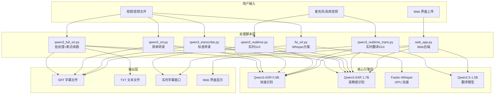
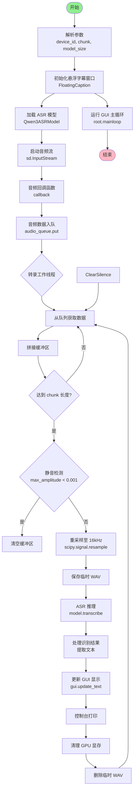
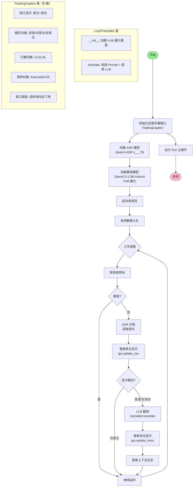
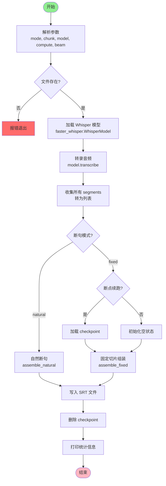
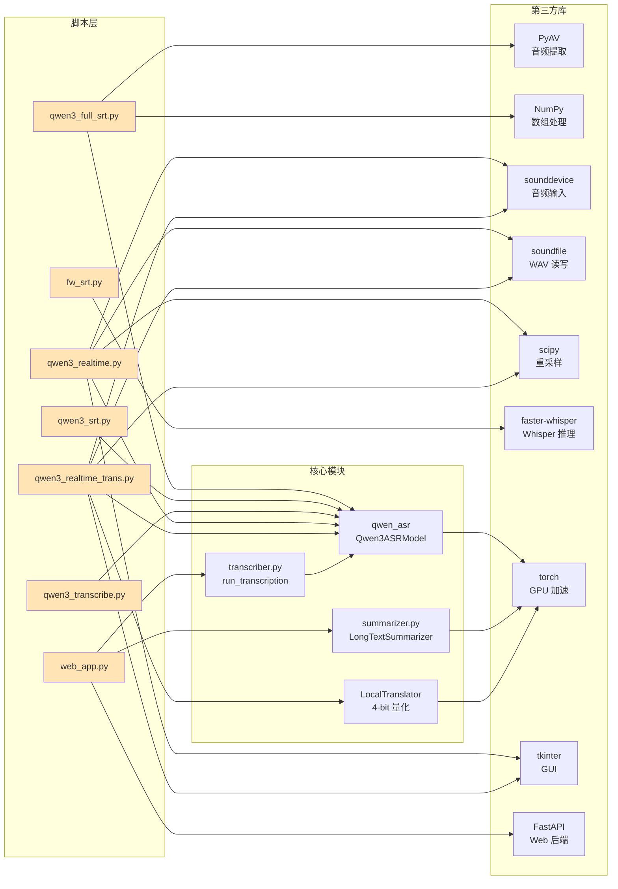
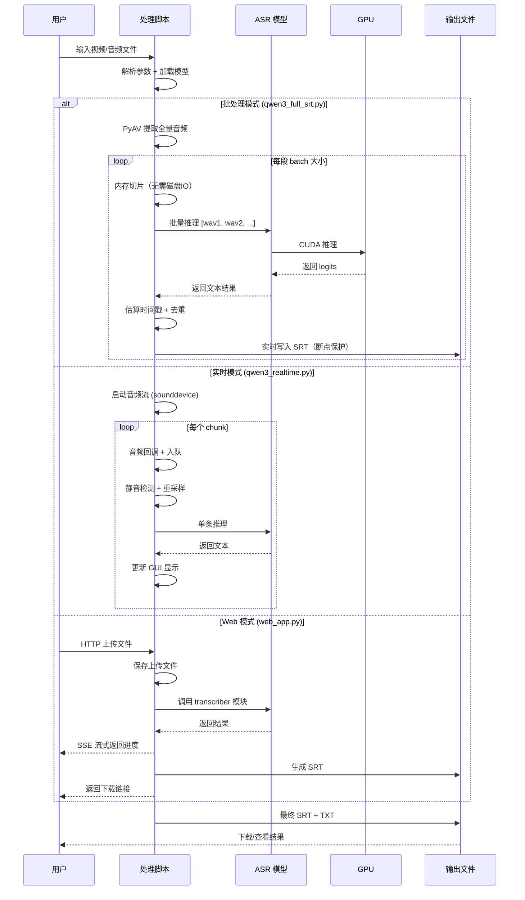
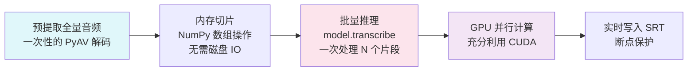
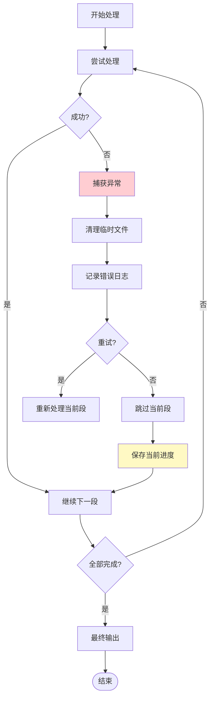
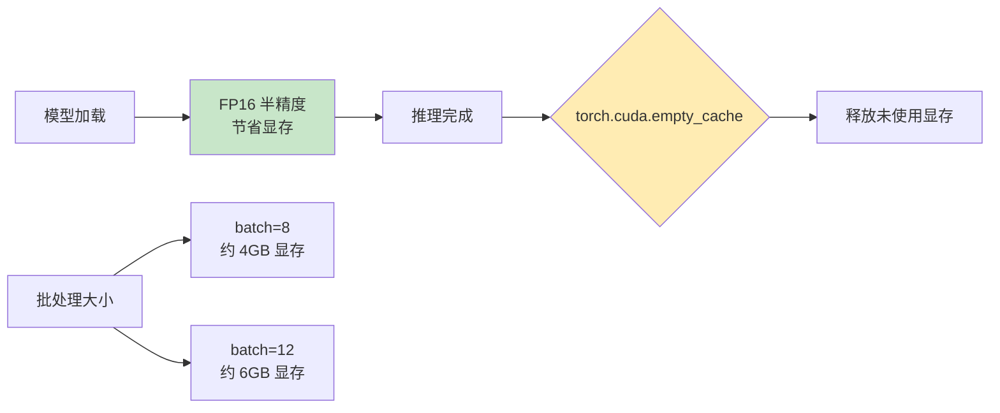

# Qwen3-ASR 项目代码分析与流程图

> 分析时间：2026-05-10  
> 项目路径：D:\qwen3-asr  
> 分析者：QClaw AI Assistant

---

## 一、项目概述

**Qwen3-ASR AI 智能音视频工作站** 是一个基于 Qwen3-ASR 和 Qwen2.5 大模型构建的本地化音视频处理工作站，支持：
- 音视频字幕提取（ASR）
- 长文本智能总结
- 实时语音转文字（带翻译）
- GPU 实时监控

---

## 二、项目文件结构

```
D:\qwen3-asr\
├── models\                     # 模型文件
│   ├── Qwen\Qwen3-ASR-0___6B\    # 0.6B ASR 模型
│   ├── Qwen\Qwen3-ASR-1___7B\    # 1.7B ASR 模型
│   └── Qwen\Qwen2.5-1.5B-Instruct\  # 翻译用 LLM
├── venv\                       # Python 虚拟环境
├── static\                     # Web 静态资源
├── templates\                  # Web 模板
├── recordings\                 # 录音文件
├── qwen3_full_srt.py          # 全量批处理转录（主脚本）
├── qwen3_srt.py               # 简单 SRT 生成
├── qwen3_transcribe.py        # 转录脚本（另一版本）
├── qwen3_realtime.py          # 实时转录（GUI）
├── qwen3_realtime_trans.py    # 实时转录+翻译（GUI）
├── fw_srt.py                  # Faster-Whisper 方案
├── web_app.py                 # Web 界面后端（FastAPI）
├── transcriber.py             # 转录核心模块
├── summarizer.py              # 文本总结模块
└── README.md                  # 项目文档
```

---

## 三、系统架构图



---

## 四、核心脚本流程图

### 4.1 qwen3_full_srt.py（全量批处理转录）

```mermaid
flowchart TD
    Start([开始]) --> ParseArgs[解析命令行参数<br/>input, chunk, batch, resume]
    ParseArgs --> CheckFile{文件存在?}
    CheckFile -->|否| Error1[报错退出]
    CheckFile -->|是| GetDuration[获取视频总时长<br/>av.open]
    
    GetDuration --> CheckResume{启用断点续跑?}
    CheckResume -->|是| LoadCkpt[加载 checkpoint<br/>ckpt.json]
    CheckResume -->|否| InitVars[初始化变量<br/>all_segs=[], done=set]
    
    LoadCkpt --> LoadModel[加载 ASR 模型<br/>Qwen3ASRModel.from_pretrained]
    InitVars --> LoadModel
    
    LoadModel --> ExtractAudio[预提取全量音频<br/>PyAV 解码 + 重采样至 16kHz]
    
    ExtractAudio --> BatchLoop{批处理循环}
    
    BatchLoop --> GetBatch[获取当前批次索引<br/>batch_start 到 batch_start+batch]
    GetBatch --> FilterDone{过滤已完成段落}
    FilterDone --> IsEmpty{批次为空?}
    IsEmpty -->|是| CheckDone{全部完成?}
    IsEmpty -->|否| SliceAudio[内存切片<br/>extract_wav_from_array]
    
    SliceAudio --> BatchInfer[批量推理<br/>model.transcribe]
    BatchInfer --> ProcessResult[处理结果<br/>提取文本 + 估算时间戳]
    ProcessResult --> UpdateSegs[更新 all_segs 和 done]
    UpdateSegs --> CleanTemp[删除临时 WAV 文件]
    CleanTemp --> SaveCkpt[保存 checkpoint]
    SaveCkpt --> UpdateSRT[更新 SRT 文件]
    UpdateSRT --> PrintProgress[打印进度条]
    PrintProgress --> BatchLoop
    
    CheckDone -->|是| FinalWrite[最终写入 SRT + TXT]
    FinalWrite --> DeleteCkpt[删除 checkpoint 文件]
    DeleteCkpt --> End([结束])
    
    style Start fill:#90EE90
    style End fill:#FFB6C1
    style Error1 fill:#FF6B6B
```

**关键函数说明：**

| 函数名 | 功能 | 输入 | 输出 |
|--------|------|------|------|
| `format_time(s)` | 秒数转 SRT 时间格式 | float 秒数 | HH:MM:SS,mmm |
| `extract_wav_from_array()` | 从音频数组切片保存 WAV | 数组, 采样率, 起止时间 | WAV 文件 |
| `estimate_timestamps()` | 估算词时间戳（按标点分割） | 文本, 开始时间, 持续时间 | [(start, end, text), ...] |
| `write_srt()` | 写入 SRT 文件（去重） | segments 列表, 输出路径 | SRT 文件 |
| `write_txt()` | 写入纯文本文件 | segments 列表, 输出路径 | TXT 文件 |

---

### 4.2 qwen3_realtime.py（实时转录 GUI）



**FloatingCaption 类方法：**

| 方法 | 功能 |
|------|------|
| `__init__()` | 初始化透明悬浮窗口，置顶，无边框 |
| `update_text(text)` | 更新字幕显示（保留最近两行） |
| `cycle_lang(event)` | 切换语种（Auto/Ja/En/Zh） |
| `start_move()` / `do_move()` | 鼠标拖动窗口 |
| `run()` | 启动 Tkinter 主循环 |

---

### 4.3 qwen3_realtime_trans.py（实时翻译 GUI）



---

### 4.4 fw_srt.py（Faster-Whisper 方案）



---

## 五、模块依赖关系图



---

## 六、数据流向图



---

## 七、关键算法说明

### 7.1 批处理加速原理（qwen3_full_srt.py）



**性能对比：**
- 逐段处理：每次都要 Python 调用 + GPU 传输 → 开销大
- 批处理（batch=12）：一次 GPU 调用处理 12 段 → 吞吐量提升 ~8x

### 7.2 时间戳估算算法（estimate_timestamps）

```python
def estimate_timestamps(text, cs, cd):
    """按中文标点分割，估算每个句子的起始/结束时间"""
    sents = re.split(r'[。！？\n]', text)  # 按标点分割
    total = sum(len(s.replace(' ', '')) for s in sents)  # 总字符数
    
    pos = cs
    for s in sents:
        dur = len(s) / total * cd  # 按字符数比例分配时间
        result.append((pos, pos + dur, s))
        pos += dur
```

### 7.3 静音检测算法（实时模式）

```python
max_amplitude = np.abs(chunk).max()
if max_amplitude < 0.001:  # 阈值
    continue  # 跳过静音段
```

---

## 八、配置参数详解

### 8.1 qwen3_full_srt.py 参数

| 参数 | 默认值 | 说明 |
|------|--------|------|
| `input` | 必填 | 输入音视频文件路径 |
| `--chunk` | 30 | 每段长度（秒） |
| `--batch` | 8 | 批处理大小 |
| `--model_dir` | D:\qwen3-asr\models | 模型目录 |
| `--output` | 自动生成 | 输出 SRT 路径 |
| `--resume` | False | 从 checkpoint 继续 |

### 8.2 qwen3_realtime.py 参数

| 参数 | 默认值 | 说明 |
|------|--------|------|
| `--device_id` | None | 音频设备 ID |
| `--chunk` | 2.5 | 音频块长度（秒） |
| `--model_size` | 1.7B | 模型大小 |
| `--loopback` | False | 尝试自动开启内录 |

---

## 九、错误处理与恢复机制



**Checkpoint 文件格式（JSON）：**
```json
{
  "segments": [(start, end, text), ...],
  "done": [0, 1, 2, 5, 6, ...]  // 已完成的段索引
}
```

---

## 十、GPU 显存管理



---

## 十一、总结

### 项目优势
1. **双引擎支持**：Qwen3-ASR（方言识别） + Faster-Whisper（速度快）
2. **批处理加速**：预提取音频 + 批量推理，充分利用 GPU
3. **断点续跑**：Checkpoint 机制，中断后可恢复
4. **实时翻译**：ASR + LLM 翻译，同声传译体验
5. **Web 界面**：FastAPI + SSE，友好的用户体验

### 技术亮点
- PyAV 音频提取（避免 FFmpeg 依赖）
- NumPy 内存切片（零磁盘 IO）
- 4-bit 量化翻译模型（节省显存）
- Tkinter 透明悬浮窗（无需额外依赖）

---

*分析完成时间：2026-05-10*  
*工具：QClaw AI Assistant*
